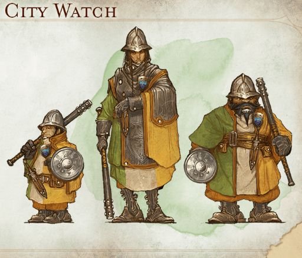

# Neutral?
- `Durnan`
    - 
    - human, fighter?, high level (4 attacks)
    - owner/operator of the `[yawning portal]`

- `Yagra`
    - half-orc
    - 7ft tall
    - friend of `bru`'s
    - get's assaulted by a bald guy with eye tattoos all over his head in the `[yawning portal]`
    - smitten w/ `bru`

- Volothemp "`Volo`" Geddarm
    - 
    - human
    - chronicler, wizard
    - minor celebrity
    - hired us to find his friend `Flune Blagar`
    - author of "Volo's Guide to Monsters"

- `Flune Blagar`
    - human
    - very handsome, with wavy strawberry blonde hair
    - drinking buddy of `Volo`'s

- `Renaer Neverember`
    - 
    - upper class rich kid who was drinking with `Flune Blagar` shortly before his disappearance
    - son of `Dagult Neverember`
    - mid in terms of looks
    - rescued by us from the closet of warehouse

- `Dagult Neverember`
    - ex open lord
    - father of `Ranaer Neverember`
    - a very ambitious man who married into quite a bit of money
    - his terrible ineptitude and violent tendencies led him to conspire against other court leaders and partner with the violent
    - “The `Zhentarim` thinks that my father embezzled a large amount of gold while he was Open Lord, and that he hid the dragons somewhere in the city. They think they can find it by using an artifact called the Stone of Golorr, which was in the hands of the Xanathar Guild until recently. Apparently, someone stole it. The Zhents thought I knew something about all of this, but I don't. My father and I haven't spoken in years.” -- `Ranaer Neverember`

# Guilds and Groups
## The `City Watch`

cops of the city

- `Hyustus Staget`
    - leader of some sort

## `Zhentarim`
shady guild of mercenaries

run by a group called the doomraiders who used to raid dooms (lich lairs)

currently a schism of sorts taking place, one sect is dead set on taking over the city

they own the `[Skewered dragon]`

`Pearson` got on the bad side of one of the sects

rumor has it they are feuding with the `Xanathar`, which explains the escalating violence

black tattoo of a snake on forearm is their symbol

- `Davil Starsong`
    - elf, bard
    - head of the `Zhentarim`
    - likes `Pearson`
---

## `Xanathar`
not a legally recognized guild, criminals

their mark is a black circle with 10 lines radiating out of it like a wheel

rumor has it they are feuding with the `Zhentarim`, which explains the escalating violence

black tattoo on his right hand that looks like a circle with 10 spokes radiating out of it is their symbol

they employ the Kenku we saw

---
