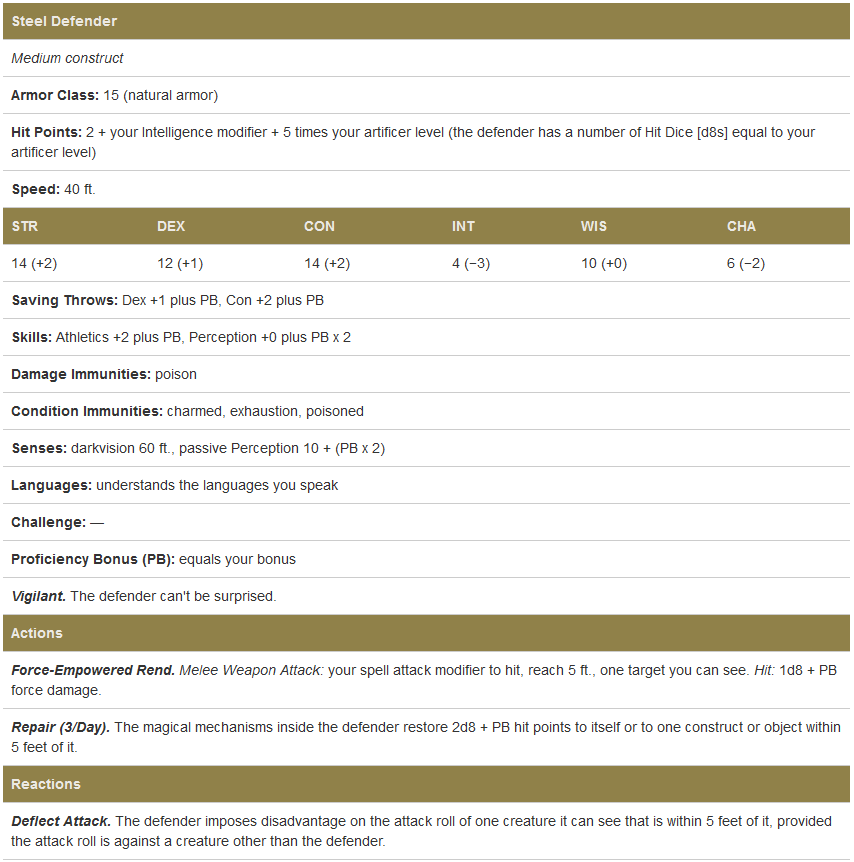

# Artillerist with a 2 level warlock dip
- Race: Variant Human
    - 2x +1 ability score
    - +1 proficiency in a skill
    - +1 feat (actor)
        - Increase your Charisma score by 1, to a maximum of 20.
        - You have an advantage on Charisma (Deception) and Charisma (Performance) checks when trying to pass yourself off as a different person.
        - You can mimic the speech of another person or the sounds made by other creatures. You must have heard the person speaking, or heard the creature make the sound, for at least 1 minute. A successful Wisdom (Insight) check contested by your Charisma (Deception) check allows a listener to determine that the effect is faked.
- Background: Urban Bounty Hunter
    - prof in deception & persuasion
- Stats
    - STR: 8
    - DEX: 14
    - CON: 14
    - INT: 15 + 1 (stats)
    - WIS: 8
    - CHA: 12 + 1 (actor) + 1 (stats)
- first 3 levels in artificer to get to artillerist
- next 2 levels in warlock

- Spell Slots
    - Artificer
        - 1: 3
    - Warlock
        - 1: 2

## Levels
1: Artificer (1)
-

# Mounted Artificer/Bladesinger

## Race: Gnome
- Ability Score Increase. Your Intelligence score increases by 2.
- Age. Gnomes mature at the same rate as humans, and most are expected to settle into adult life around the age of 40. They can live to 350 years on average, but it's not too uncommon for them to reach 500 years of age.
- Alignment. Gnomes are generally Good. Those who tend towards Law are sages, engineers, researchers, scholars, investigators, or inventors. Those who tend towards Chaos are often minstrels, tricksters, wanderers, or fanciful jewelers. Gnomes are light-hearted, and even the tricksters amongst them favor harmless pranks over vicious schemes.
- Size. Gnomes are between 3 and 4 feet tall and weigh around 40 pounds. Your size is Small.
- Speed. Your base walking speed is 25 feet.
- Darkvision. Accustomed to life underground, you have superior vision in dark and dim conditions. You can see in dim light within 60 feet of you as if it were bright light, and in darkness as if it were dim light. You can't discern color in darkness, only shades of gray.
- Gnome Cunning. You have advantage on all Intelligence, Wisdom, and Charisma saves against magic.
- Languages. You can read, speak, and write Common and Gnomish.
- Forest Gnome
    - Ability Score Increase. Your Dexterity score increases by 1.
    - Natural Illusionist. You know the Minor Illusion cantrip. Intelligence is your spellcasting modifier for it.
    - Speak with Small Beasts. Through sound and gestures, you may communicate simple ideas with Small or smaller beasts.

### Base Stats
|  | STD(PB) |
| - | - |
| STR | 8(8) |
| DEX | 14(15) + 1 |
| CON | 13(15) |
| INT | 15(15) + 2 |
| WIS | 12(8) |
| CHA | 10(8) |

## Race Kobold
- Ability Score Increase. Your Dexterity score increases by 2.
- Age. Kobolds reach adulthood at age 6 and can live up to 120 years but rarely do so.
- Alignment. Kobolds are fundamentally selfish, making them evil, but their reliance on the strength of their group makes them trend toward law.
- Size. Kobolds are between 2 and 3 feet tall and weigh between 25 and 35 pounds. Your size is Small.
- Speed. Your base walking speed is 30 feet.
- Darkvision. You can see in dim light within 60 feet of you as if it were bright light, and in darkness as if it were dim light. You can't discern color in darkness, only shades of gray.
- Grovel, Cower, and Beg. As an action on your turn, you can cower pathetically to distract nearby foes. Until the end of your next turn, your allies gain advantage on attack rolls against enemies within 10 feet of you that can see you. Once you use this trait, you can't use it again until you finish a short or long rest.
- Pack Tactics. You have advantage on an attack roll against a creature if at least one of your allies is within 5 feet of the creature and the ally isn't incapacitated.
- Sunlight Sensitivity. You have disadvantage on attack rolls and on Wisdom (Perception) checks that rely on sight when you, the target of your attack, or whatever you are trying to perceive is in direct sunlight.
- Languages. You can speak, read, and write Common and Draconic.

### Base Stats
|  | STD(PB) |
| - | - |
| STR | 8(8) |
| DEX | 14(15) + 2 |
| CON | 13(15) |
| INT | 15(15) |
| WIS | 12(8) |
| CHA | 10(8) |

## Backstory
- TBD

## Starting Feat
- Spell Sniper
    - You have learned techniques to enhance your attacks with certain kinds of spells, gaining the following benefits:
    - When you cast a spell that requires you to make an attack roll, the spell's range is doubled.
    - Your ranged spell attacks ignore half cover and three-quarters cover.
    - You learn one cantrip that requires an attack roll. Choose the cantrip from the bard, cleric, druid, sorcerer, warlock, or wizard spell list. Your spellcasting ability for this cantrip depends on the spell list you chose from: Charisma for bard, sorcerer, and warlock; Wisdom for cleric or druid; or Intelligence for wizard.

## Spells
artificer is 1/2 of levels rounded up
- Cantrips
    - 2 from artificer
    - 3 from wizard
- 1st level
    - slots: 4
- 2nd level
    - slots: 3

- Known:
    - Artificer
        - Intelligence modifier + half your artificer level, rounded down (minimum of one spell)
    - Wizard
        - 8 (6 + 2) all 1st level
        - Each time you gain a wizard level, you can add two wizard spells of your choice to your spellbook.
- Prepared
    - Intelligence modifier + your wizard level (minimum of one spell)
    - Intelligence modifier + half your artificer level, rounded down (minimum of one spell)

## Artificer (1-3)
- Hit Points
    - Hit Dice: 1d8 per artificer level
    - Hit Points at 1st Level: 8 + your Constitution modifier
    - Hit Points at Higher Levels: 1d8 (or 5) + your Constitution modifier per artificer level after 1st
- Proficiencies
    - Armor: Light armor, medium armor, shields
    - Weapons: Simple weapons
    - Tools: Thieves’ tools, tinker’s tools, one type of artisan’s tools of your choice
    - Saving Throws: Constitution, Intelligence
    - Skills: Choose two from Arcana, History, Investigation, Medicine, Nature, Perception, Sleight of Hand
- Spellcasting
    - You've studied the workings of magic and how to cast spells, channeling the magic through objects. To observers, you don't appear to be casting spells in a conventional way; you appear to produce wonders from mundane items and outlandish inventions.
    - Tools Required
        - You produce your artificer spell effects through your tools. You must have a spellcasting focus-specifically thieves' tools or some kind of artisan's tool-in hand when you cast any spell with this Spellcasting feature (meaning the spell has an "M" component when you cast it). You must be proficient with the tool to use it in this way. See the equipment chapter in the Player's Handbook for descriptions of these tools.
        - After you gain the Infuse Item feature at 2nd level, you can also use any item bearing one of your infusions as a spellcasting focus.
    - Cantrips (0-Level Spells)
        - At 1st level, you know two cantrips of your choice from the artificer spell list. At higher levels, you learn additional artificer can trips of your choice, as shown in the Cantrips Known column of the Artificer table.
        - When you gain a level in this class, you can replace one of the artificer cantrips you know with another cantrip from the artificer spell list.
    - Preparing and Casting Spells
        - The Artificer table shows how many spell slots you have to cast your artificer spells. To cast one of your artificer spells of 1st level or higher, you must expend a slot of the spell's level or higher. You regain all expended spell slots when you finish a long rest.
        - You prepare the list of artificer spells that are available for you to cast, choosing from the artificer spell list. When you do so, choose a number of artificer spells equal to your Intelligence modifier + half your artificer level, rounded down (minimum of one spell). The spells must be of a level for which you have spell slots.
        - For example, if you are a 5th-level artificer, you have four 1st-level and two 2nd-level spell slots. With an Intelligence of 14, your list of prepared spells can include four spells of 1st or 2nd level, in any combination. If you prepare the 1st-level spell Cure Wounds, you can cast it using a lst-level or a 2nd-level slot. Casting the spell doesn't remove it from your list of prepared spells.
        - You can change your list of prepared spells when you finish a long rest. Preparing a new list of artificer spells requires time spent tinkering with your spellcasting focuses: at least 1 minute per spell level for each spell on your list.
    - Spellcasting Ability
        - Intelligence is your spellcasting ability for your artificer spells; your understanding of the theory behind magic allows you to wield these spells with superior skill. You use your Intelligence whenever an artificer spell refers to your spellcasting ability. In addition, you use your Intelligence modifier when setting the saving throw DC for an artificer spell you cast and when making an attack roll with one.
        - Spell save DC = 8 + your proficiency bonus + your Intelligence modifier
        - Spell attack modifier = your proficiency bonus + your Intelligence modifier
    - Ritual Casting
        - You can cast an artificer spell as a ritual if that spell has the ritual tag and you have the spell prepared.
- Magical Tinkering
    - At 1st level, you've learned how to invest a spark of magic into mundane objects. To use this ability, you must have thieves' tools or artisan's tools in hand. You then touch a Tiny nonmagical object as an action and give it one of the following magical properties of your choice:
        - The object sheds bright light in a 5-foot radius and dim light for an additional 5 feet.
        - Whenever tapped by a creature, the object emits a recorded message that can be heard up to 10 feet away. You utter the message when you bestow this property on the object, and the recording can be no more than 6 seconds long.
        - The object continuously emits your choice of an odor or a nonverbal sound (wind, waves, chirping, or the like). The chosen phenomenon is perceivable up to 10 feet away.
        - A static visual effect appears on one of the object's surfaces. This effect can be a picture, up to 25 words of text, lines and shapes, or a mixture of these elements, as you like.
    - The chosen property lasts indefinitely. As an action, you can touch the object and end the property early.
    - You can bestow magic on multiple objects, touching one object each time you use this feature, though a single object can only bear one property at a time. The maximum number of objects you can affect with this feature at one time is equal to your Intelligence modifier (minimum of one object). If you try to exceed your maximum, the oldest property immediately ends, and then the new property applies.
- Infuse Item
    - At 2nd level, you've gained the ability to imbue mundane items with certain magical infusions, turning those objects into magic items.
    - Infusions Known
        - When you gain this feature, pick four artificer infusions to learn. You learn additional infusions of your choice when you reach certain levels in this class, as shown in the Infusions Known column of the Artificer table.
        - Whenever you gain a level in this class, you can replace one of the artificer infusions you learned with a new one.
        - Infusing an Item
        - Whenever you finish a long rest, you can touch a nonmagical object and imbue it with one of your artificer infusions, turning it into a magic item. An infusion works on only certain kinds of objects, as specified in the infusion's description. If the item requires attunement, you can attune yourself to it the instant you infuse the item. If you decide to attune to the item later, you must do so using the normal process for attunement (see the attunement rules in the Dungeon Master's Guide).
        - Your infusion remains in an item indefinitely, but when you die, the infusion vanishes after a number of days equal to your Intelligence modifier (minimum of 1 day). The infusion also vanishes if you replace your knowledge of the infusion.
        - You can infuse more than one nonmagical object at the end of a long rest; the maximum number of objects appears in the Infused Items column of the Artificer table. You must touch each of the objects, and each of your infusions can be in only one object at a time. Moreover, no object can bear more than one of your infusions at a time. If you try to exceed your maximum number of infusions, the oldest infusion ends, and then the new infusion applies.
        - If an infusion ends on an item that contains other things, like a bag of holding, its contents harmlessly appear in and around its space.
- The Right Tool for the Job
    - At 3rd level, you've learned how to produce exactly the tool you need: with thieves' tools or artisan's tools in hand, you can magically create one set of artisan's tools in an unoccupied space within 5 feet of you. This creation requires 1 hour of uninterrupted work, which can coincide with a short or long rest. Though the product of magic, the tools are nonmagical, and they vanish when you use this feature again.

### Subclass: Battle Smith
- Tool Proficiency
    - When you adopt this specialization at 3rd level, you gain proficiency with smith's tools. If you already have this proficiency, you gain proficiency with one other type of artisan's tools of your choice.
- Battle Smith Spells
    - 3: Heroism, Shield
- Battle Ready
    - You gain proficiency with martial weapons.
    - When you attack with a magic weapon, you can use your Intelligence modifier, instead of Strength or Dexterity modifier, for the attack and damage rolls.
- Steel Defender
    - By 3rd level, your tinkering has borne you a faithful companion, a steel defender. It's friendly to you and your companions, and it obeys your commands. See its game statistics in the Steel Defender stat block, which uses your proficiency bonus (PB) in several places. You determine the creature's appearance and whether it has two legs or four; your choice has no effect on its game statistics.
    - In combat, the defender shares your initiative count, but it takes its turn immediately after yours. It can move and use its reaction on its own, but the only action it takes on its turn is the Dodge action, unless you take a bonus action on your turn to command it to take another action. That action can be one in its stat block or some other action. If you are incapacitated, the defender can take any action of its choice, not just Dodge.
    - If the Mending spell is cast on it, it regains 2d6 hit points. If it has died within the last hour, you can use your smith's tools as an action to revive it, provided you are within 5 feet of it and you expend a spell slot of 1st level or higher. The steel defender returns to life after 1 minute with all its hit points restored.
    - At the end of a long rest, you can create a new steel defender if you have smith's tools with you. If you already have a defender from this feature, the first one immediately perishes. The defender also perishes if you die.
    - 

## Wizard (4-5)
- Hit Points
    - Hit Dice: 1d6 per wizard level
    - Hit Points at Higher Levels: 1d6 (or 4) + your Constitution modifier per wizard level after 1st
- Spellcasting
    - As a student of arcane magic, you have a spellbook containing spells that show the first glimmerings of your true power.
    - Cantrips
        - At 1st level, you know three cantrips of your choice from the wizard spell list. You learn additional wizard cantrips of your choice at higher levels, as shown in the Cantrips Known column of the Wizard table.
    - Spellbook
        - At 1st level, you have a spellbook containing six 1st-level wizard spells of your choice.
        - The spells that you add to your spellbook as you gain levels reflect the arcane research you conduct on your own, as well as intellectual breakthroughs you have had about the nature of the multiverse. You might find other spells during your adventures. You could discover a spell recorded on a scroll in an evil wizard's chest, for example, or in a dusty tome in an ancient library.
        - **Copying a Spell into the Book.** When you find a wizard spell of 1st level or higher, you can add it to your spellbook if it is of a level for which you have spell slots and if you can spare the time to decipher and copy it.
        - Copying a spell into your spellbook involves reproducing the basic form of the spell, then deciphering the unique system of notation used by the wizard who wrote it. You must practice the spell until you understand the sounds or gestures required, then transcribe it into your spellbook using your own notation.
        - For each level of the spell, the process takes 2 hours and costs 50 gp. The cost represents material components you expend as you experiment with the spell to master it, as well as the fine inks you need to record it. Once you have spent this time and money, you can prepare the spell just like your other spells.
        - **Replacing the Book.** You can copy a spell from your own spellbook into another book-for example, if you want to make a backup copy of your spellbook. This is just like copying a new spell into your spellbook, but faster and easier, since you understand your own notation and already know how to cast the spell. You need spend only 1 hour and 10 gp for each level of the copied spell.
        - If you lose your spellbook, you can use the same procedure to transcribe the spells that you have prepared into a new spellbook. Filling out the remainder of your spellbook requires you to find new spells to do so, as normal. For this reason, many wizards keep backup spellbooks in a safe place.
        - **The Book's Appearance.** Your spellbook is a unique compilation of spells, with its own decorative flourishes and margin notes. It might be a plain, functional leather volume that you received as a gift from your master, a finely bound gilt-edged tome you found in an ancient library or even a loose collection of notes scrounged together after you lost your previous spellbook in a mishap.
    - Preparing and Casting Spells
        - The Wizard table shows how many spell slots you have to cast your spells of 1st level and higher. To cast one of these spells, you must expend a slot of the spell's level or higher. You regain all expended spell slots when you finish a long rest.
        - You prepare the list of wizard spells that are available for you to cast. To do so, choose a number of wizard spells from your spellbook equal to your Intelligence modifier + your wizard level (minimum of one spell). The spells must be of a level for which you have spell slots.
        - For example, if you're a 3rd-level wizard, you have four 1st-level and two 2nd-level spell slots. With an Intelligence of 16, your list of prepared spells can include six spells of 1st or 2nd level, in any combination, chosen from your spellbook. If you prepare the 1st-level spell Magic Missile, you can cast it using a 1st-level or a 2nd-level slot. Casting the spell doesn't remove it from your list of prepared spells.
        - You can change your list of prepared spells when you finish a long rest. Preparing a new list of wizard spells requires time spent studying your spellbook and memorizing the incantations and gestures you must make to cast the spell: at least 1 minute per spell level for each spell on your list.
    - Spellcasting Ability
        - Intelligence is your spellcasting ability for your wizard spells, since you learn your spells through dedicated study and memorization. You use your Intelligence whenever a spell refers to your spellcasting ability. In addition, you use your Intelligence modifier when setting the saving throw DC for a wizard spell you cast and when making an attack roll with one.
        - Spell save DC = 8 + your proficiency bonus + your Intelligence modifier
        - Spell attack modifier = your proficiency bonus + your Intelligence modifier
    - Ritual Casting
        - You can cast a wizard spell as a ritual if that spell has the ritual tag and you have the spell in your spellbook. You don't need to have the spell prepared.
    - Spellcasting Focus
        - You can use an arcane focus as a spellcasting focus for your wizard spells.
    - Learning Spells of 1st Level and Higher
        - Each time you gain a wizard level, you can add two wizard spells of your choice to your spellbook. Each of these spells must be of a level for which you have spell slots, as shown on the Wizard table. On your adventures, you might find other spells that you can add to your spellbook.
- Arcane Recovery
    - You have learned to regain some of your magical energy by studying your spellbook. Once per day when you finish a short rest, you can choose expended spell slots to recover. The spell slots can have a combined level that is equal to or less than half your wizard level (rounded up), and none of the slots can be 6th level or higher.
    - For example, if you're a 4th-level wizard, you can recover up to two levels worth of spell slots. You can recover either a 2nd-level spell slot or two 1st-level spell slots.

### Subclass: Bladesinging
- Training in War and Song
    - When you adopt this tradition at 2nd level, you gain proficiency with light armor, and you gain proficiency with one type of one-handed melee weapon of your choice.
    - You also gain proficiency in the Performance skill if you don’t already have it.
- Bladesong
    - Starting at 2nd level, you can invoke an elven magic called the Bladesong, provided that you aren’t wearing medium or heavy armor or using a shield. It graces you with supernatural speed, agility, and focus.
    - You can use a bonus action to start the Bladesong, which lasts for 1 minute. It ends early if you are incapacitated, if you don medium or heavy armor or a shield, or if you use two hands to make an attack with a weapon. You can also dismiss the Bladesong at any time (no action required).
    - While your Bladesong is active, you gain the following benefits:
        - You gain a bonus to your AC equal to your Intelligence modifier (minimum of +1)
        - Your walking speed increases by 10 feet.
        - You have advantage on Dexterity (Acrobatics) checks.
        - You gain a bonus to any Constitution saving throw you make to maintain your concentration on a spell. The bonus equals your Intelligence modifier (minimum of +1).
    - You can use this feature a number of times equal to your proficiency bonus, and you regain all expended uses of it when you finish a long rest.

## Equipment
- any two simple weapons
- a light crossbow and 20 bolts
- (a) studded leather armor or (b) scale mail
thieves’ tools and a dungeoneer’s pack
- a lance?

# Fuck all that noise, "full" artificer
DM's discretion, kobold seems like it would be busted
## Race Kobold
- Ability Score Increase. Your Dexterity score increases by 2.
- Age. Kobolds reach adulthood at age 6 and can live up to 120 years but rarely do so.
- Alignment. Kobolds are fundamentally selfish, making them evil, but their reliance on the strength of their group makes them trend toward law.
- Size. Kobolds are between 2 and 3 feet tall and weigh between 25 and 35 pounds. Your size is Small.
- Speed. Your base walking speed is 30 feet.
- Darkvision. You can see in dim light within 60 feet of you as if it were bright light, and in darkness as if it were dim light. You can't discern color in darkness, only shades of gray.
- Grovel, Cower, and Beg. As an action on your turn, you can cower pathetically to distract nearby foes. Until the end of your next turn, your allies gain advantage on attack rolls against enemies within 10 feet of you that can see you. Once you use this trait, you can't use it again until you finish a short or long rest.
- Pack Tactics. You have advantage on an attack roll against a creature if at least one of your allies is within 5 feet of the creature and the ally isn't incapacitated.
- Sunlight Sensitivity. You have disadvantage on attack rolls and on Wisdom (Perception) checks that rely on sight when you, the target of your attack, or whatever you are trying to perceive is in direct sunlight.
- Languages. You can speak, read, and write Common and Draconic.

## Backstory
## Starting Feat: Crossbow Expert
- You ignore the loading quality of crossbows with which you are proficient.
- Being within 5 feet of a hostile creature doesn’t impose disadvantage on your ranged attack rolls.
- When you use the Attack action and attack with a one handed weapon, you can use a bonus action to attack with a hand crossbow you are holding.

## Stats at level 5
### Progression
- lvl 1 fighter, take archery fighting style, we get second wind!
- lvl 2-5 artificer
    - infusions
        - repeating shot
            - This magic weapon grants a + 1 bonus to attack and damage rolls made with it when it's used to make a ranged attack, and it ignores the loading property if it has it.
            - If you load no ammunition in the weapon, it produces its own, automatically creating one piece of magic ammunition when you make a ranged attack with it. The ammunition created by the weapon vanishes the instant after it hits or misses a target.
        - enhanced defense (skip and boost someone else's weapon/focus)
            - A creature gains a +1 bonus to Armor Class while wearing (armor) or wielding (shield) the infused item.
            - The bonus increases to +2 when you reach 10th level in this class.
    - 4th level ASI: Sharpshooter
        - You have mastered ranged weapons and can make shots that others find impossible. You gain the following benefits:
            - Attacking at long range doesn't impose disadvantage on your ranged weapon attack rolls.
            - Your ranged weapon attacks ignore half and three-quarters cover.
            - Before you make an attack with a ranged weapon that you are proficient with, you can choose to take a -5 penalty to the attack roll. If that attack hits, you add +10 to the attack's damage.

- attack roll 
    - +2 archery
    - +1 infusion
    - +3 proficiency
    - +2 int
    - advantage

- AC
    - +16-18 heavy armour
    - +2 shield

(rolling would probably be better?)
|  | STD |
| - | - |
| STR | 8 |
| DEX | 12 +2 |
| CON | 14 |
| INT | 15 |
| WIS | 13 |
| CHA | 10 |

- lvl 6 (artificer 5)
    - 2nd level spell slots
    - extra attack
    - Branding Smite, Warding Bond
- lvl 7 (artificer 6)
    - +1 infusion, give to party member or...
        - repulsion shield
            - A creature gains a +1 bonus to Armor Class while wielding this shield.
            - The shield has 4 charges. While holding it, the wielder can use a reaction immediately after being hit by a melee attack to expend 1 of the shield's charges and push the attacker up to 15 feet away. The shield regains 1d4 expended charges daily at dawn.
    - Tool Expertise
        - At 6th level, your proficiency bonus is now doubled for any ability check you make that uses your proficiency with a tool.
- lvl 8 (artificer 7)
    - Flash of Genius
        - At 7th level, you've gained the ability to come up with solutions under pressure. When you or another creature you can see within 30 feet of you makes an ability check or a saving throw, you can use your reaction to add your Intelligence modifier to the roll.
        - You can use this feature a number of times equal to your Intelligence modifier (minimum of once). You regain all expended uses when you finish a long rest.
- lvl 9 (artificer 8)
    - ASI int 15 -> 17 (maybe half feat? telekinetic w/ mage hand!!)
        - maybe just pump con and use headband of intellect @ lvl 11, buffing allies probably better
- lvl 10 (artificer 9)
    - 3rd level spell slots
    - Arcane Jolt
        - At 9th level, you've learn new ways to channel arcane energy to harm or heal. When either you hit a target with a magic weapon attack or your steel defender hits a target, you can channel magical energy through the strike to create one of the following effects:
            - The target takes an extra 2d6 force damage.
            - Choose one creature or object you can see within 30 feet of the target. Healing energy flows into the chosen recipient, restoring 2d6 hit points to it.
            - You can use this energy a number of times equal to your Intelligence modifier (minimum of once), but you can do so no more than once on a turn. You regain all expended uses when you finish a long rest.
- lvl 11 (artificer 10)
    - +1 infusion

## Fighter (1)
- Hit Points
    - Hit Dice: 1d10 per fighter level
    - Hit Points at 1st Level: 10 + your Constitution modifier
- Proficiencies
    - Armor: All armor, shields
    - Weapons: Simple weapons, martial weapons
    - Tools: None
    - Saving Throws: Strength, Constitution
    - Skills: Choose two skills from Acrobatics, Animal Handling, Athletics, History, Insight, Intimidation, Perception, and Survival
- Equipment
    - (a) chain mail or (b) leather, longbow, and 20 arrows
    - (a) a martial weapon and a shield or (b) two martial weapons
    - (a) a light crossbow and 20 bolts or (b) two handaxes
    - (a) a dungeoneer's pack or (b) an explorer's pack
- Fighting Style: Archery
    - You gain a +2 bonus to attack rolls you make with ranged weapons.
- Second Wind
    - You have a limited well of stamina that you can draw on to protect yourself from harm. On your turn, you can use a bonus action to regain hit points equal to 1d10 + your fighter level.
    - Once you use this feature, you must finish a short or long rest before you can use it again.

## Artificer (2-5)
- Hit Points
    - Hit Dice: 1d8 per artificer level
    - Hit Points at Higher Levels: 1d8 (or 5) + your Constitution modifier per artificer level after 1st
- Spellcasting
    - You've studied the workings of magic and how to cast spells, channeling the magic through objects. To observers, you don't appear to be casting spells in a conventional way; you appear to produce wonders from mundane items and outlandish inventions.
    - Tools Required
        - You produce your artificer spell effects through your tools. You must have a spellcasting focus-specifically thieves' tools or some kind of artisan's tool-in hand when you cast any spell with this Spellcasting feature (meaning the spell has an "M" component when you cast it). You must be proficient with the tool to use it in this way. See the equipment chapter in the Player's Handbook for descriptions of these tools.
        - After you gain the Infuse Item feature at 2nd level, you can also use any item bearing one of your infusions as a spellcasting focus.
    - Cantrips (0-Level Spells)
        - At 1st level, you know two cantrips of your choice from the artificer spell list. At higher levels, you learn additional artificer can trips of your choice, as shown in the Cantrips Known column of the Artificer table.
        - When you gain a level in this class, you can replace one of the artificer cantrips you know with another cantrip from the artificer spell list.
    - Preparing and Casting Spells
        - The Artificer table shows how many spell slots you have to cast your artificer spells. To cast one of your artificer spells of 1st level or higher, you must expend a slot of the spell's level or higher. You regain all expended spell slots when you finish a long rest.
        - You prepare the list of artificer spells that are available for you to cast, choosing from the artificer spell list. When you do so, choose a number of artificer spells equal to your Intelligence modifier + half your artificer level, rounded down (minimum of one spell). The spells must be of a level for which you have spell slots.
        - For example, if you are a 5th-level artificer, you have four 1st-level and two 2nd-level spell slots. With an Intelligence of 14, your list of prepared spells can include four spells of 1st or 2nd level, in any combination. If you prepare the 1st-level spell Cure Wounds, you can cast it using a lst-level or a 2nd-level slot. Casting the spell doesn't remove it from your list of prepared spells.
        - You can change your list of prepared spells when you finish a long rest. Preparing a new list of artificer spells requires time spent tinkering with your spellcasting focuses: at least 1 minute per spell level for each spell on your list.
    - Spellcasting Ability
        - Intelligence is your spellcasting ability for your artificer spells; your understanding of the theory behind magic allows you to wield these spells with superior skill. You use your Intelligence whenever an artificer spell refers to your spellcasting ability. In addition, you use your Intelligence modifier when setting the saving throw DC for an artificer spell you cast and when making an attack roll with one.
        - Spell save DC = 8 + your proficiency bonus + your Intelligence modifier
        - Spell attack modifier = your proficiency bonus + your Intelligence modifier
    - Ritual Casting
        - You can cast an artificer spell as a ritual if that spell has the ritual tag and you have the spell prepared.
- Magical Tinkering
    - At 1st level, you've learned how to invest a spark of magic into mundane objects. To use this ability, you must have thieves' tools or artisan's tools in hand. You then touch a Tiny nonmagical object as an action and give it one of the following magical properties of your choice:
        - The object sheds bright light in a 5-foot radius and dim light for an additional 5 feet.
        - Whenever tapped by a creature, the object emits a recorded message that can be heard up to 10 feet away. You utter the message when you bestow this property on the object, and the recording can be no more than 6 seconds long.
        - The object continuously emits your choice of an odor or a nonverbal sound (wind, waves, chirping, or the like). The chosen phenomenon is perceivable up to 10 feet away.
        - A static visual effect appears on one of the object's surfaces. This effect can be a picture, up to 25 words of text, lines and shapes, or a mixture of these elements, as you like.
    - The chosen property lasts indefinitely. As an action, you can touch the object and end the property early.
    - You can bestow magic on multiple objects, touching one object each time you use this feature, though a single object can only bear one property at a time. The maximum number of objects you can affect with this feature at one time is equal to your Intelligence modifier (minimum of one object). If you try to exceed your maximum, the oldest property immediately ends, and then the new property applies.
- Infuse Item
    - At 2nd level, you've gained the ability to imbue mundane items with certain magical infusions, turning those objects into magic items.
    - Infusions Known
        - When you gain this feature, pick four artificer infusions to learn. You learn additional infusions of your choice when you reach certain levels in this class, as shown in the Infusions Known column of the Artificer table.
        - Whenever you gain a level in this class, you can replace one of the artificer infusions you learned with a new one.
        - Infusing an Item
        - Whenever you finish a long rest, you can touch a nonmagical object and imbue it with one of your artificer infusions, turning it into a magic item. An infusion works on only certain kinds of objects, as specified in the infusion's description. If the item requires attunement, you can attune yourself to it the instant you infuse the item. If you decide to attune to the item later, you must do so using the normal process for attunement (see the attunement rules in the Dungeon Master's Guide).
        - Your infusion remains in an item indefinitely, but when you die, the infusion vanishes after a number of days equal to your Intelligence modifier (minimum of 1 day). The infusion also vanishes if you replace your knowledge of the infusion.
        - You can infuse more than one nonmagical object at the end of a long rest; the maximum number of objects appears in the Infused Items column of the Artificer table. You must touch each of the objects, and each of your infusions can be in only one object at a time. Moreover, no object can bear more than one of your infusions at a time. If you try to exceed your maximum number of infusions, the oldest infusion ends, and then the new infusion applies.
        - If an infusion ends on an item that contains other things, like a bag of holding, its contents harmlessly appear in and around its space.
- The Right Tool for the Job
    - At 3rd level, you've learned how to produce exactly the tool you need: with thieves' tools or artisan's tools in hand, you can magically create one set of artisan's tools in an unoccupied space within 5 feet of you. This creation requires 1 hour of uninterrupted work, which can coincide with a short or long rest. Though the product of magic, the tools are nonmagical, and they vanish when you use this feature again.

### Subclass: Battle Smith
- Tool Proficiency
    - When you adopt this specialization at 3rd level, you gain proficiency with smith's tools. If you already have this proficiency, you gain proficiency with one other type of artisan's tools of your choice.
- Battle Smith Spells
    - 3: Heroism, Shield
- Battle Ready
    - You gain proficiency with martial weapons.
    - When you attack with a magic weapon, you can use your Intelligence modifier, instead of Strength or Dexterity modifier, for the attack and damage rolls.
- Steel Defender
    - By 3rd level, your tinkering has borne you a faithful companion, a steel defender. It's friendly to you and your companions, and it obeys your commands. See its game statistics in the Steel Defender stat block, which uses your proficiency bonus (PB) in several places. You determine the creature's appearance and whether it has two legs or four; your choice has no effect on its game statistics.
    - In combat, the defender shares your initiative count, but it takes its turn immediately after yours. It can move and use its reaction on its own, but the only action it takes on its turn is the Dodge action, unless you take a bonus action on your turn to command it to take another action. That action can be one in its stat block or some other action. If you are incapacitated, the defender can take any action of its choice, not just Dodge.
    - If the Mending spell is cast on it, it regains 2d6 hit points. If it has died within the last hour, you can use your smith's tools as an action to revive it, provided you are within 5 feet of it and you expend a spell slot of 1st level or higher. The steel defender returns to life after 1 minute with all its hit points restored.
    - At the end of a long rest, you can create a new steel defender if you have smith's tools with you. If you already have a defender from this feature, the first one immediately perishes. The defender also perishes if you die.
    - 

- person who just charms people, thats it
- monk that punches people to heal them
